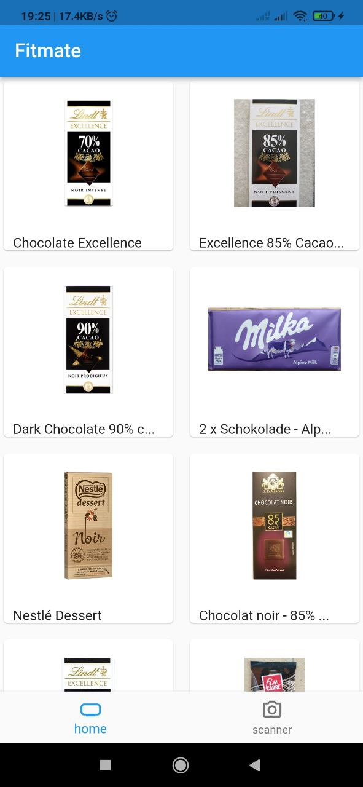
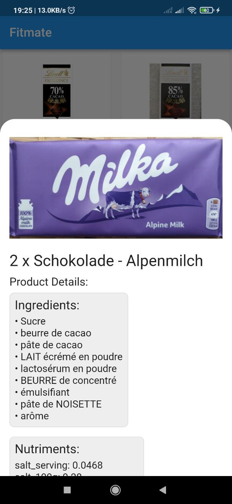
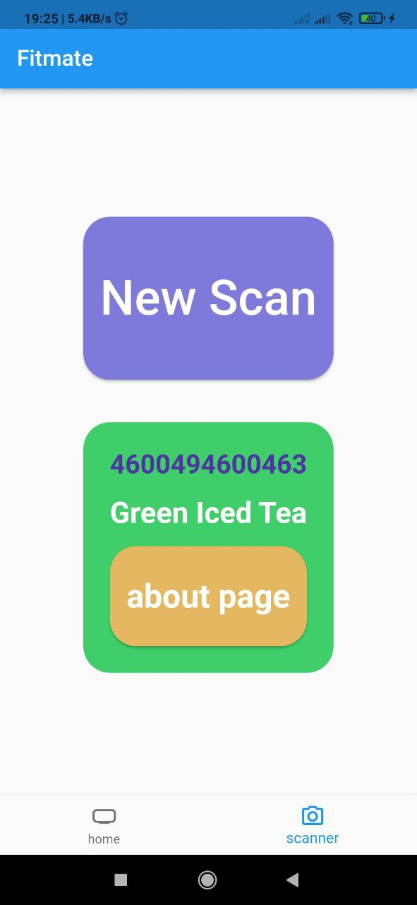
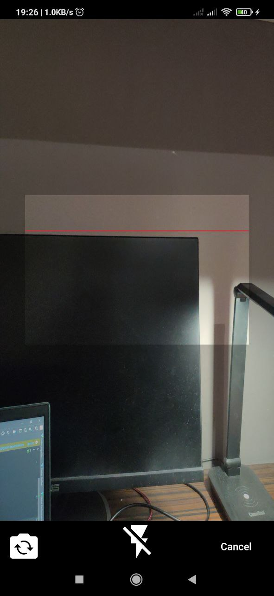
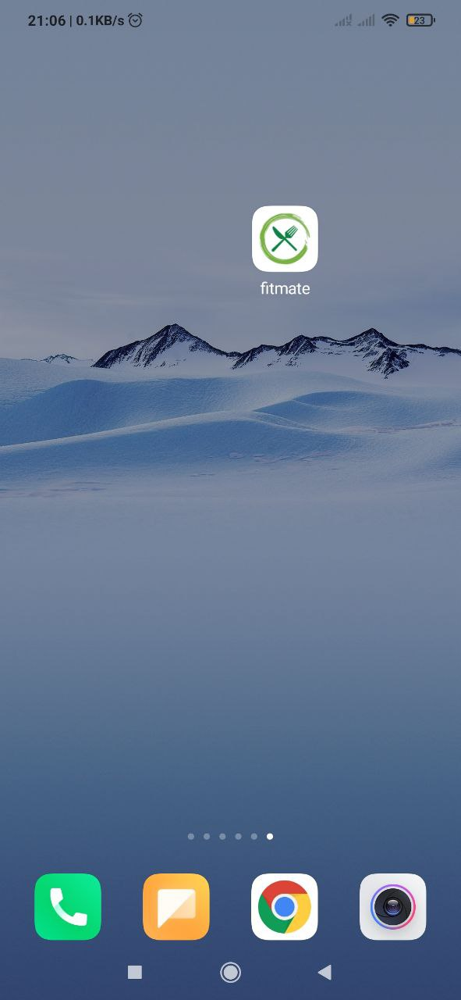

### Fitmate 
#### Description of our flutter project 
Purchase Checker is the app to check purchases in such markets as Pyaterochka, Magnit etc. using their bar code. The application allows to see the composition of the product, its' healthiness. Moreover, it allows to visualize proportions of  fats, proteins and carbohydrates. As an extension application can check if the product satisfy certain standards (Halal Standard, No Sugar Standard, etc.). Our application will be useful for people who care about their health while doing purchases in the market.

### Bloc 

We have bloc for api, barcode and internet.
- Internet bloc - check if the internet is available using lib connectivity plus. Here we have two state connected and not connected
- Api bloc - return the product. Here we have one event AllProductsApiEvent which return all products. In futher we will add the event such as choose, filter and search events.  
- Barcode bloc - responsible for scanning the barcode and filtering products using the barcode. 

## Images 

|                   All products                           |                        Specific product              |                       scanner page                   |    Camera                    |   App icon
|:-------------------------------------------------:|:----------------------------------------------:|:----------------------------------------------:|:----------------------------------:|:------------------------------------------------:
|  |   |  |  | 
